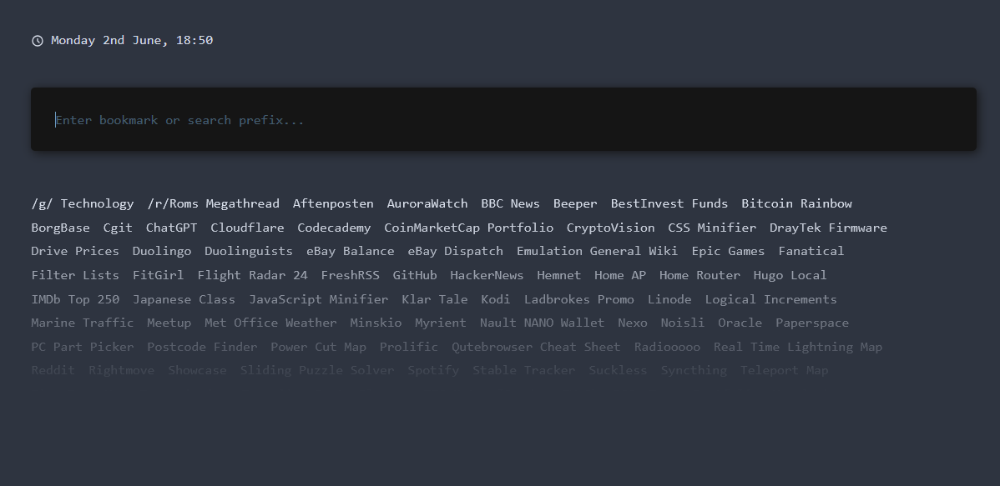

# Startpage

This project was originally forked from [EmDev21/TerminalStartpage](https://github.com/EmDev21/TerminalStartpage) for the purposes of tailoring its' features specifically to me. The project was then entirely rewritten as of [commit f32b77e](https://github.com/breadcat/startpage/commit/f32b77ebfc92c2c0b84ee0370b3d5ab4f011eabd) to fix some bugs, add some features and generally clean up the code.

## Original Features
* Site-specific search prefixes
* Hardcoded bookmark filtering
* Not much else...

## Rewrite Features
* Up/Down/Tab/Shift-Tab navigation of bookmarks
* Fallback to Google Search
* Case insensitive prefixes
* Arrays for bookmarks
* Smaller functions for prefixes
* Light/Dark favicons
* Continue filtering while navigating bookmarks
* Preview of prefix destination when matched
* Live time/date with ordinals
* New bugs!

Check the page source for a rundown of how things work, there's a [live preview hosted](https://breadcat.github.io/startpage/) on Github Pages.